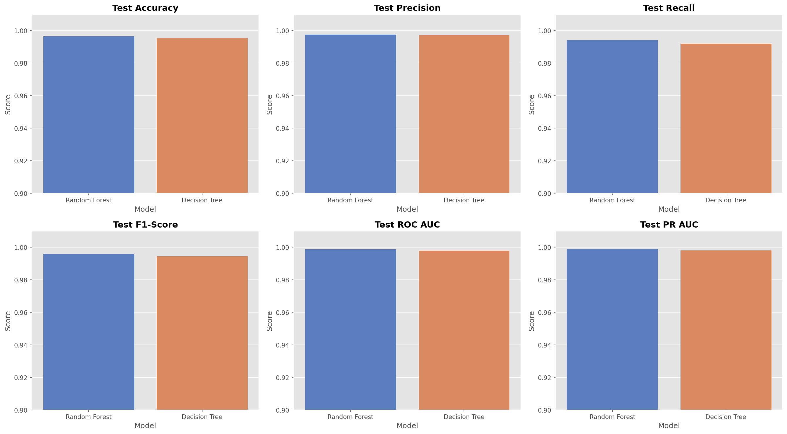
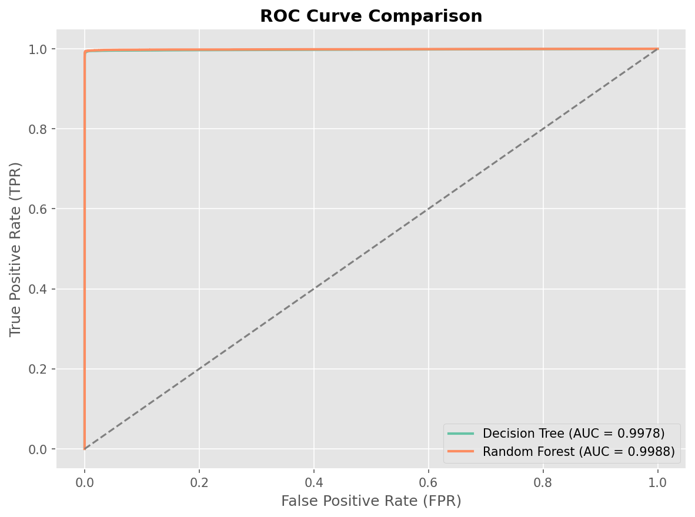
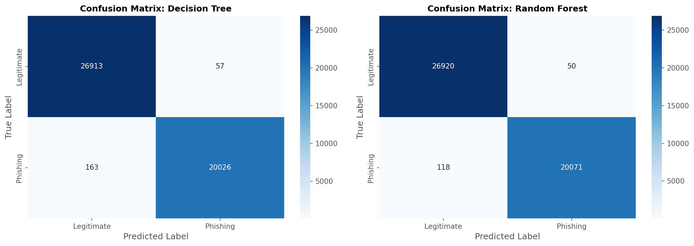
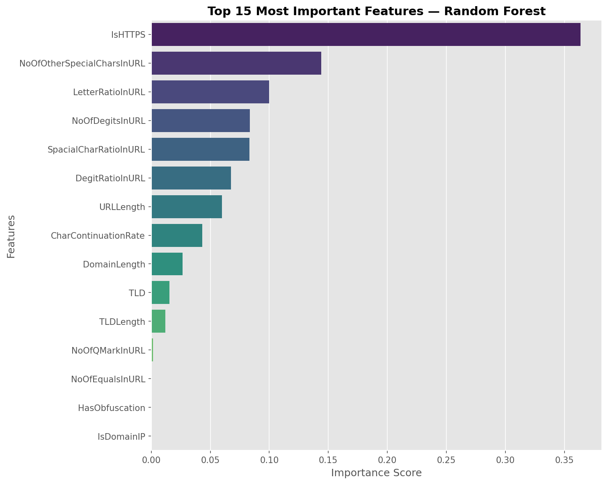

# Perbandingan Decision Tree & Random Forest Model untuk Deteksi Link Phishing Berbasis Pure URL Features 

Proyek ini bertujuan mengembangkan model klasifikasi *machine learning* yang andal, efisien, dan siap digunakan di dunia nyata untuk mendeteksi situs web *phishing*. Keunggulan utama dari proyek ini adalah penggunakan pendekatan **murni berbasis fitur URL (*Lexical Analysis*)**. Pendekatan ini memastikan proses deteksi bisa dilakukan secara *real-time* dengan meminimalisir risiko keamanan.

---

## Anggota Kelompok
- **Immanuel Raditya Deo Pratama Pambudhi** - 103132430001
- **Jury Maxwell** - 103132400023
- **Muhammad 'Izzudin Nabil** - 103132400032

---

## Deskripsi Permasalahan
Serangan *phishing* merupakan salah satu ancaman kejahatan siber yang paling marak saat ini. Penyerang umumnya mengeksploitasi kelalaian pengguna dengan memanipulasi tautan untuk mencuri data sensitif seperti kredensial *login* dan informasi finansial. 

Banyak penelitian terdahulu yang mengandalkan **fitur konten/HTML** (seperti jumlah gambar, keberadaan *form* kosong, atau *script* internal) demi mencapai akurasi tinggi. Namun, jika diterapkan di dunia nyata, pendekatan berbasis konten ini memiliki **kelemahan besar**:
1. **Risiko Keamanan:** Sistem harus membuka, mengunduh, dan me-render halaman web yang mencurigakan terlebih dahulu. Hal ini jelas sangat berbahaya bagi infrastruktur jaringan.
2. **Latensi Tinggi:** Proses *rendering* HTML membutuhkan waktu yang tidak sebentar, sehingga tidak cocok untuk deteksi instan (misalnya pada ekstensi peramban atau filter DNS).

**Solusi Proyek Ini:**  
Kami sengaja mengeliminasi seluruh fitur yang berbau konten/HTML dan melatih model **murni menggunakan fitur tekstual URL saja**. Pendekatan ini memaksa algoritma untuk berhadapan dengan skenario yang lebih realistis dan kompetitif. Hasilnya? Model menjadi sangat ringan, jauh lebih aman, dan mampu bekerja dengan tingkat latensi yang amat rendah.

---

## Sumber dan Deskripsi Dataset
Data yang digunakan dalam proyek ini adalah **PhiUSIIL Phishing URL Dataset**, yang dapat diakses secara publik melalui [UCI Machine Learning Repository](https://archive.ics.uci.edu/dataset/967/phiusiil%2Bphishing%2Burl%2Bdataset).

- **Total Data:** 235.795 URL. Terdiri dari 134.850 URL legal (non-phishing) dan 100.945 URL phishing.
- **Fitur Awal:** 57 atribut (56 fitur struktural/konten dan 1 target label).
- **Karakteristik Target (`label`):** `0` untuk *Legitimate* (Web Asli) dan `1` untuk *Phishing*. *(Catatan: Label diinversi pada tahap preprocessing agar nilai positif berfokus pada kelas phishing).*

---

## Tahapan Preprocessing
Untuk menghindari bias pengujian yang terlalu optimis (*data leakage*), seluruh proses manipulasi dan transformasi data dibungkus rapat ke dalam objek `Pipeline` dari Scikit-Learn. Pemisahan data dilakukan di awal dengan proporsi **80% Training Set** dan **20% Testing Set**.

Langkah-langkah di dalam *pipeline* meliputi:
1. **Pembersihan Metadata:** Menghapus kolom identitas atau referensi eksternal seperti `FILENAME`, `URL`, `Domain`, dan `Title`.
2. **Eksklusi Fitur Konten (HTML):** Membuang 26 fitur berbasis konten (seperti `NoOfImage`, `LineOfCode`, `HasSocialNet`) untuk mengembalikan fokus utama pemodelan murni pada teks URL.
3. **Frequency Encoding:** Mengubah fitur kategorikal `TLD` (Top-Level Domain) menjadi angka (*numerical*) berdasarkan seberapa sering domain tersebut muncul di dalam data latih.
4. **Correlation Filter:** Mendeteksi dan membuang fitur yang saling tumpang tindih atau memiliki korelasi sangat tinggi ($>0.90$) guna menghindari redundansi (misalnya, `NoOfLettersInURL` terbuang secara otomatis).
5. **ANOVA Selection (`SelectKBest`):** Memanfaatkan uji statistik $F$-value untuk memilah dan mempertahankan 15 fitur URL yang terbukti paling berpengaruh membedakan kelas target.

---

## Metode yang Digunakan
Kami menguji dan membandingkan dua algoritma berbasis pohon (*tree-based algorithms*):
1. **Decision Tree Classifier:** Digunakan sebagai model dasar (*baseline*) mengingat cara kerjanya yang sederhana dan mudah diinterpretasikan aturan pemisahannya.
2. **Random Forest Classifier:** Algoritma *ensemble* unggulan yang memanfaatkan banyak pohon keputusan acak secara bersamaan. Algoritma ini dirancang untuk meminimalkan potensi *overfitting* serta mendongkrak stabilitas prediksi.

---

## Cara Menjalankan Program

### Prasyarat
- Python 3.10 atau versi yang lebih baru.
- (Opsional namun disarankan) *Environment manager* seperti Miniconda/Anaconda.

### Langkah-Langkah Eksekusi
1. **Clone Repositori:**
   ```bash
   git clone https://github.com/ImmanuelDeo/Phishing-Link-Detection-TubesML.git
   cd Phishing-Link-Detection-TubesML
   ```
2. **Install Dependensi:**
   ```bash
   pip install -r requirements.txt
   ```
3. **Jalankan Pipeline End-to-End:**
   ```bash
   python main.py
   ```
   *Skrip ini akan mengeksekusi seluruh siklus secara otomatis mulai dari load data, cross-validation, evaluasi, penyimpanan plot visualisasi, hingga ekspor model terbaik dalam format `.pkl`.*

---

## Hasil Eksperimen dan Evaluasi

Berdasarkan pengujian ekstensif pada *Testing Set* (sekitar 47.159 data URL), **Random Forest** terbukti mengungguli Decision Tree dan otomatis terpilih sebagai model final. 

### Ringkasan Metrik
| Model | Accuracy | F1-Score | ROC-AUC |
| :--- | :---: | :---: | :---: |
| **Random Forest** | **99.64%** | **99.58%** | **99.88%** |
| Decision Tree | 99.53% | 99.45% | 99.78% |

### Visualisasi Performa

**1. Perbandingan Metrik Kedua Model**  
Grafik di bawah ini membandingkan kinerja Decision Tree dan Random Forest dari berbagai aspek metrik evaluasi. Keduanya menunjukkan angka di atas 99%, namun Random Forest sedikit lebih konsisten.  


**2. Kurva ROC-AUC**  
Kurva ROC (*Receiver Operating Characteristic*) membuktikan seberapa baik model memisahkan URL Phishing dan Legitimate. Skor AUC (*Area Under the Curve*) mencapai 0.9988 untuk Random Forest. Hal ini mengindikasikan kemampuan model yang nyaris sempurna (mendekati nilai maksimal 1.0) dalam membedakan kedua kelas tanpa melakukan tebakan acak. Semakin kurva mendekati sudut kiri atas, semakin ahli model mengidentifikasi tautan berbahaya tanpa salah mencurigai tautan asli.  


**3. Confusion Matrix**  
Matriks ini merinci prediksi nyata model pada 47.159 data uji. Hasilnya menunjukkan tingkat kesalahan prediksi yang amat rendah. Khusus pada *Random Forest*, dari puluhan ribu data, model nyaris tidak pernah salah memblokir tautan legal (angka *False Positive* sangat kecil) dan hanya melewatkan sebagian kecil tautan phishing (*False Negative*). Sifat ini sangat krusial untuk mencegah pengguna terganggu oleh peringatan keamanan palsu.  


**4. Feature Importance (Random Forest)**  
Analisis ini membuktikan bahwa fitur seperti panjang huruf, kemiripan URL, dan struktur karakter memainkan peran paling fatal dalam menentukan apakah suatu *link* itu asli atau palsu. Fitur-fitur leksikal ini secara empiris mendominasi kekuatan prediksi (*importance score*) model dibandingkan sekadar ekstensi domain.  


---

## Keterbatasan Model
Meskipun memiliki akurasi di atas 99%, pendekatan *Lexical Analysis* menggunakan model *Tree-based* memiliki beberapa celah kelemahan di dunia nyata:
1. **Rentan Terhadap Data Drift:** Model tidak berimajinasi; ia hanya mengenali pola historis data latih. Jika peretas mengubah drastis taktiknya (contoh: beralih ke URL super pendek dengan domain premium .com/.org), model bisa kebingungan gagal mendeteksi taktik *zero-day phishing*.
2. **Keterbatasan Ekstrapolasi Algoritma Pohon:** Algoritma berbasis pohon ahli dalam mengenali data yang mirip, tetapi sangat lemah jika memprediksi data yang karakteristiknya berbanding terbalik di luar rentang latihannya. Ini membuat model berpotensi *overfitting* pada pola serangan lama.
3. **Titik Buta pada *Compromised Domains*:** Karena konten situs diabaikan demi kecepatan, jika situs resmi institusi diretas dan disusupi form pencurian password, model akan kebobolan. Secara struktur teks, URL tersebut tetap terbaca sebagai situs bereputasi tinggi (*Legitimate*).
4. **Kamuflase URL Shorteners:** Layanan penyingkat tautan (seperti *bit.ly* atau *t.co*) membunuh 100% fitur struktural asli URL. Tanpa diintegrasikan dengan modul tambahan *unshortening* (pengurai tautan asli), akurasi model akan langsung runtuh karena pola kriminalnya tersembunyi.

---

## Kesimpulan
Penggunaan fitur murni berbasis *URL* (tanpa mengunduh konten HTML sama sekali) ternyata **sangat cukup** untuk mendeteksi ancaman tautan *phishing*. 

Lewat implementasi *machine learning* menggunakan metode **Random Forest**, proyek ini berhasil menyentuh akurasi hingga **99.64%**. 

Ke depannya, *pipeline* model (yang kini sudah tersimpan di file `best_model.pkl`) ini sudah siap dikembangkan lebih jauh, seperti diintegrasikan ke dalam sebuah *API*, ekstensi browser keamanan, ataupun langsung ditanam ke pemfilteran DNS jaringan.
